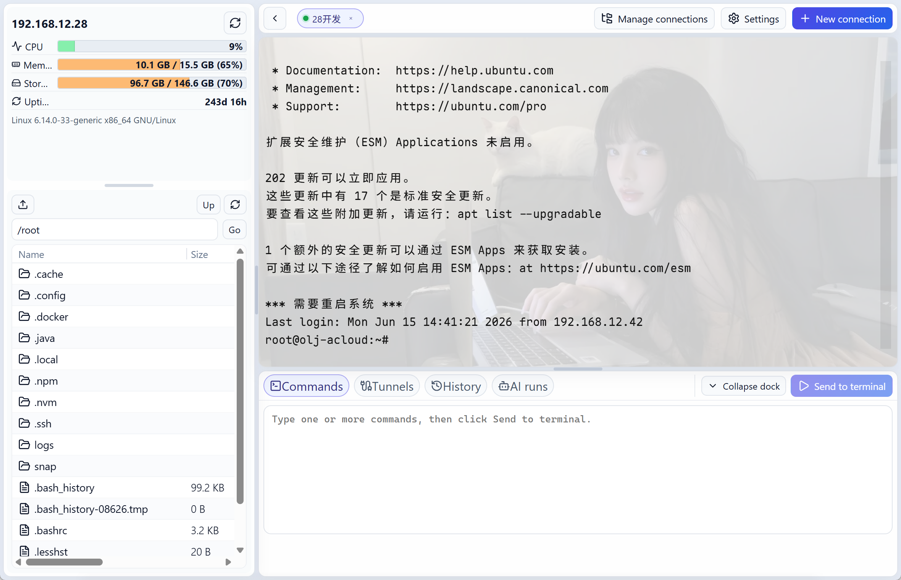
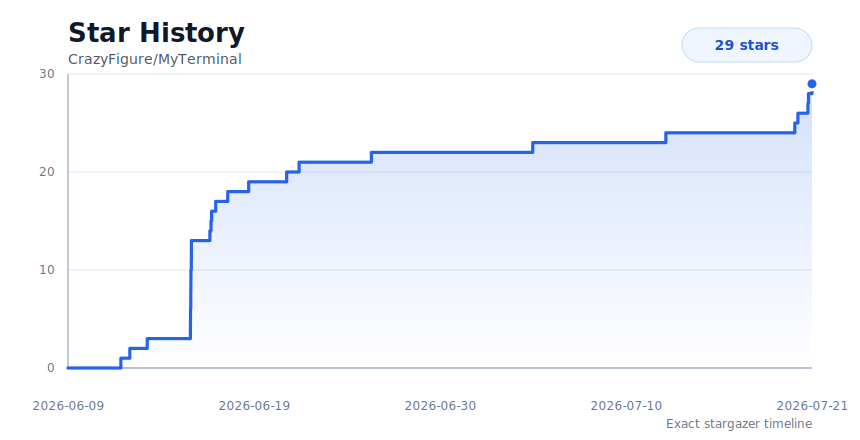

# MyTerminal

[English](./README.md) | [简体中文](./README_CN.md)


A modern desktop SSH terminal manager built with Rust, Tauri 2, and React.

MyTerminal brings terminal tabs, SSH profiles with jump hosts and proxies, SFTP file management, remote file editing, local port forwarding, and WebDAV backup into one clean desktop app. It is designed for developers and operators who want a lightweight, open, and hackable alternative to heavyweight remote terminal suites.



## Features

### SSH Profiles and Routing

- **SSH profile manager** - Create, edit, group, duplicate, move, sort, and test SSH connections before opening a session.
- **Password and private-key authentication** - Connect with passwords, key files, or pasted private-key content, including passphrase and secret visibility toggles where needed.
- **Jump hosts** - Configure ordered SSH jump-host chains and reuse the same routing model for terminals, file operations, tunnels, and MCP Bridge sessions.
- **First-hop proxies** - Route the first SSH hop through SOCKS5 or HTTP CONNECT proxies with optional proxy authentication.
- **Safe connection cleanup** - Closing tabs, deleting profiles, or exiting the app stops related terminal sessions, auxiliary SSH sessions, tunnels, and CLI bridge processes.

### Terminal Workspace

- **Tabbed SSH terminals** - Open multiple PTY sessions, reorder tabs, reconnect in place, close sessions, and keep the session title tied to the active SSH profile.
- **Non-blocking connection startup** - New SSH tabs enter a connecting state immediately while SSH handshake and authentication run in the background.
- **Interactive input handling** - Printable input is lightly batched to reduce WebView-to-Rust IPC load, while Enter, Tab, control sequences, and editing keys are flushed immediately.
- **Right-click workflows** - Use right-click menu actions for copy and paste, or configure right-click to paste directly; terminal focus is restored after menu actions.
- **Cursor recovery** - Remote programs that hide the terminal cursor and fail to restore it are handled at prompt boundaries so the input cursor comes back.
- **Local cursor fallback** - The frontend restores xterm cursor visibility when switching sessions or replaying cached output, without sending control characters back to SSH.
- **Search and fit behavior** - xterm.js powers terminal rendering, sizing, and terminal search support.
- **Focus-aware session switching** - Switching sessions, reconnecting, and delayed SSH startup restore input focus when the target terminal is ready.
- **SSH long-line display modes** - SSH sessions can wrap automatically or keep long output on one horizontally scrolling line; local terminals and TUIs always wrap.
- **Path-aware terminal output** - The shell injects a cwd sync hook so the app can follow remote directory changes made with `cd`, `pushd`, or `popd`.
- **Direct-input cwd refresh** - Typed or pasted `cd` commands refresh the file panel early, then backend cwd markers correct the path if needed.
- **Child-shell cwd sync** - Bash child shells inherit the cwd sync hook, while non-interactive scripts avoid emitting MyTerminal sync markers.
- **Remote shell history** - Read remote shell history files for command history features without exposing MyTerminal's internal setup command.

### Local Terminals and AI CLIs

- **Local terminal tabs** - Open native local PTY sessions beside SSH tabs, backed by ConPTY/portable-pty instead of a fake command output view.
- **AI CLI launcher** - Start Claude Code, Codex, opencode, or custom local commands from selected working directories.
- **Pure shell mode** - Choose the built-in local terminal command to open the configured shell directly without launching an AI CLI.
- **Local-only settings** - Local shell path, command presets, and directory history are stored in `local-terminals.json` and are not included in WebDAV sync packages.
- **History directories** - Reopen recent local directories, choose a command per directory at launch time, and keep history focused on paths rather than fixed command pairs.
- **Compact local tabs** - Local terminal tab titles use short directory names, such as `codex · MyTerminal` or `MyTerminal`, while full paths remain available in history and session details.

### SFTP Files and Editing

- **Remote file browser** - Browse remote directories, inspect file metadata, create folders, delete, rename, refresh, and navigate through real SFTP operations.
- **Drag-and-drop upload** - Drop local files or folders into the SFTP browser and upload folders recursively.
- **Batch transfer operations** - Download multiple remote files or folders, upload multiple local paths, and avoid overwriting same-name local downloads by generating unique destinations.
- **Connection reuse for files** - File browsing, transfers, remote editing, runtime queries, and history reads reuse auxiliary SSH/SFTP sessions instead of reconnecting for every action.
- **Stale-session recovery** - Cached auxiliary SSH sessions are discarded and retried when the remote side closes an idle connection.
- **Remote identity cache** - Remote uid/gid display names are cached per auxiliary session to avoid repeated `/etc/passwd` and `/etc/group` reads during directory refreshes.
- **Remote file editor** - Edit remote files with the built-in Monaco editor, trigger editor save actions, and write back over SFTP.
- **Editor recovery cache** - Local document cache fallback protects remote edits when loading or saving needs recovery.
- **MCP/CLI file tools** - AI clients can list, read, write, upload, download, delete, rename, and create remote paths through approved bridge operations.

### Runtime and Tunnels

- **Runtime overview** - Fetch remote OS, CPU, memory, disk, host IP, and uptime information for the active SSH profile.
- **Local port forwarding** - Create, edit, start, and stop SSH local forwarding rules with custom bind addresses and target hosts.
- **Tunnel lifecycle management** - Running tunnel records are tracked separately from terminal sessions so they can be stopped cleanly.

### MCP Bridge and AI Approval

- **MCP Bridge for AI coding tools** - Let Claude Code, Codex, and other MCP clients use saved SSH profiles through a local `CLI + MCP + GUI Broker` bridge.
- **Connection discovery** - MCP clients can list saved SSH profiles as non-secret metadata, including name, group path, host, port, username, tags, and notes.
- **Bridge sessions** - MCP clients can open and close logical SSH bridge sessions by connection ID or unique connection name, then run commands or file operations against them.
- **GUI-approved execution** - Remote commands, uploads, downloads, writes, deletes, renames, and directory creation requests are shown in MyTerminal for approval by default.
- **Right-side AI execution panel** - Pending and completed AI requests live in a resizable right sidebar so command, file, and history panels remain available.
- **Serialized session commands** - Commands submitted to the same AI bridge session run in order, while different sessions can still run concurrently.
- **Auto-execution controls** - Enable automatic bridge execution globally or allow it only for selected SSH connections.
- **AI approval notifications** - Pending AI execution requests can expand automatically, show compact SSH/command/target summaries, and raise desktop notifications with approval shortcuts where supported.
- **Agent usage guidance** - MCP clients receive tool instructions that clarify list/open/use/close flow, session ID rules, and file-write best practices.
- **Bridge reliability** - Restarting MCP Bridge settings preserves logical AI sessions, stale waiting requests are handled predictably, and app shutdown cleans bridge resources.

### Sync, Backup, and Updates

- **Manual WebDAV sync** - Upload and download app settings and SSH profiles separately when moving between machines.
- **Local import/export** - Export JSON configuration packages and restore them later, with automatic local backups before import.
- **Desktop update flow** - Check GitHub Releases, detect installer assets, download installers, and launch the installer from inside the app.
- **Proxy-aware update checks** - Update HTTP requests respect system proxy settings and use conservative connect, read, and total timeouts.
- **Installer cache validation** - Downloaded installers are written through temporary files, checked against Release asset size metadata, and reused only when the local cache is complete.

### Desktop Experience

- **Bilingual UI** - Switch between English and Simplified Chinese.
- **Theme and layout preferences** - Use light or dark mode, compact sidebar, customizable terminal fonts, terminal background images, right-click behavior, and long-line display mode.
- **System tray support** - Keep MyTerminal accessible from the desktop shell with a tray icon.
- **Local-first storage** - Settings and SSH profiles are stored locally, with encrypted secret handling inside the app and plain JSON only when you explicitly export.

## Download

Windows installers are published on the [GitHub Releases](https://github.com/CrazyFigure/MyTerminal/releases) page when a version tag is released.

MyTerminal is still early-stage software. Please keep backups of important SSH profiles and avoid treating local exports as encrypted backups: exported JSON files contain sensitive values in plain text.

## Quick Start

### Requirements

- Node.js 20.19+ or 22.12+
- npm 9+
- Rust stable with the MSVC toolchain
- Visual Studio Build Tools 2022
- Windows 10/11 SDK
- Strawberry Perl on Windows when vendored OpenSSL is required

### Run From Source

```powershell
npm install
npm run check:env
npm run tauri:dev
```

### Build Installer

```powershell
npm run package
```

Build outputs are usually generated under:

```text
src-tauri/target/release/bundle/
```

For the full Windows setup and packaging notes, see [START_BUILD.md](./START_BUILD.md).

## MCP Bridge

MyTerminal can expose your saved SSH connections to Claude Code, Codex, and other MCP clients through a local `CLI + MCP + GUI Broker` bridge.

### How it works

- The bridge is disabled by default on first use. Enable it in **Settings > MCP**; both the enabled state and auto-execution policy persist and are restored when MyTerminal restarts.
- MyTerminal starts a local Broker bound to `127.0.0.1` and writes a discovery file with the current port and token.
- Installed builds let MCP clients start the bundled `myterminal-cli` directly. Development falls back to the repository-local `npx` launcher only when the CLI executable is unavailable.
- Agents should list connections first. For simple tasks, pass the returned connection ID (or a unique connection name) directly as the remote tool `sessionId` and the bridge will create a logical session automatically. Agents can still open, reuse, and close an explicit session when independent lifecycle control is useful.
- Read-only tools, such as listing connections and reading remote files, can run directly.
- Commands sent to the same bridge session are serialized to keep remote state changes in order; separate sessions can still run concurrently.
- Command execution, local uploads, remote downloads, and write operations are shown in the MyTerminal AI request panel for approval by default.
- New pending approval requests can automatically open the AI execution panel and send a desktop notification; clicking the notification focuses the approval list.
- Auto-execution can be enabled globally, or allowed for selected SSH connections from the MCP settings page.

### MCP client config

Copy the JSON from **Settings > MCP > Usage**. In development it looks like this:

```json
{
  "mcpServers": {
    "myterminal": {
      "type": "stdio",
      "command": "npx",
      "args": [
        "--yes",
        "C:/Software/WorkSpace/MyTerminal/mcp/myterminal-mcp"
      ]
    }
  }
}
```

### Available MCP tools

- `myterminal_list_connections`
- `myterminal_open_session`
- `myterminal_close_session`
- `myterminal_run_command`
- `myterminal_file_list`
- `myterminal_file_read`
- `myterminal_file_write`
- `myterminal_file_upload`
- `myterminal_file_download`
- `myterminal_file_delete`
- `myterminal_file_rename`
- `myterminal_file_mkdir`

The connection list only returns non-secret metadata such as name, group path, host, port, username, tags, and notes. Passwords, private keys, and passphrases are never exposed through MCP.

## Useful Scripts

```powershell
npm run dev          # Start the Vite web dev server only
npm run typecheck    # Run frontend TypeScript checks
npm run check:web    # Build the frontend
npm run check:rust   # Check the Rust/Tauri backend
npm run check:perl   # Check the local Perl environment
npm run check:env    # Check Node, npm, cargo, Perl, and link.exe
npm run check        # Run frontend build and Rust backend checks
```

## Tech Stack

- **Desktop shell:** Tauri 2
- **Backend:** Rust, ssh2, reqwest, AES-GCM, local JSON persistence
- **Frontend:** React, TypeScript, Vite, Zustand
- **Terminal and editor:** xterm.js, portable-pty, Monaco Editor
- **Sync and files:** SFTP, WebDAV, local import/export

## Acknowledgements

- Thanks to the [Linux.do](https://linux.do) community for project promotion and feedback.

## Star History

[](https://github.com/CrazyFigure/MyTerminal/stargazers)

## License

[MIT](./LICENSE) © 2026 CrazyFigure
