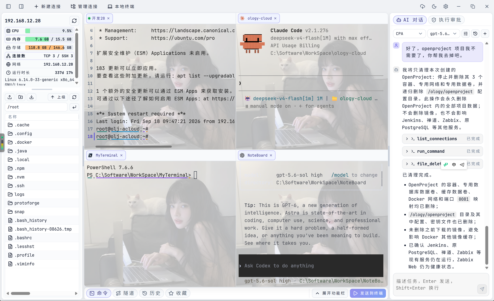

# MyTerminal

[简体中文](./README.md) | [English](./README_EN.md)

一个基于 Rust、Tauri 2 和 React 构建的现代桌面 SSH 终端管理工具。

MyTerminal 把终端标签页与拖拽分屏、支持跳板机与代理的 SSH 连接管理、Windows 远程桌面、SFTP 文件管理、远程文件编辑、本地端口转发、内置 AI 助手和 WebDAV 备份整合到一个桌面应用里。希望提供一个优雅、轻量、全面、称手的远程终端工具。

## 功能清单

### SSH 连接与链路

- **SSH 连接管理** - 新建、编辑、分组、复制、排序、连接前测试
- **密码与私钥认证** - 私钥文件、粘贴私钥、口令明文查看
- **多级跳板机** - 终端、文件与隧道共用同一链路
- **首跳代理** - SOCKS5 / HTTP CONNECT
- **Windows 远程桌面（RDP）** - 调用系统客户端打开，仅 Windows

### 终端工作区

- **多标签终端** - SSH 与本地终端混排、拖拽排序、原位重连
- **本地终端** - 原生 PTY，支持系统终端探测与默认终端指定
- **AI CLI 启动器** - Claude Code / Codex / opencode / 自定义命令
- **拖拽分屏** - 8 个吸附点，最多 4 格，每格独立标签栏
- **底部功能栏** - 历史、收藏命令、批量发送、隧道
- **终端显示增强** - 行号与时间戳、选中匹配高亮、提示符语义高亮
- **长行展示模式** - 自动换行或横向滚动
- **终端路径联动** - `cd` / `pushd` / `popd` 联动文件面板

### SFTP 文件与编辑

- **远程文件管理** - 浏览、拖放上传、批量传输、属性与重命名
- **内置编辑器** - Monaco 编辑远端文件，通过 SFTP 写回
- **MCP / CLI 文件工具** - 经审批的远程文件读写

### 运行状态与隧道

- **运行状态概览** - CPU、内存、根分区、连接数、运行时长、系统信息
- **资源明细** - 每核心占用率、进程 / 线程 Top、连接地址明细
- **多种资源来源** - 系统进程 / Docker / Podman / Kubernetes
- **本地端口转发** - 新建、编辑、开启、停止

### AI 助手与 MCP

- **AI 对话面板** - 流式输出、随时停止、新建对话、本地历史
- **多端点、多模型、三种协议** - Anthropic Messages / OpenAI Chat Completions / OpenAI Responses，Key 加密落盘
- **思考强度与上下文自动压缩** - 超阈值自动折叠旧消息
- **AI 直接操作远端** - 列连接、执行命令、读写文件
- **命令在真实终端执行** - 打进可见标签并高亮 `[AI]` 前缀
- **MCP Bridge** - 让 Claude Code、Codex 等使用已保存的 SSH 连接
- **脱敏连接发现与桥接会话** - 按连接 ID 或唯一名称打开与关闭
- **GUI 审批执行** - 默认逐条审批，可全局或按连接放行自动执行

需要自行接入 MCP 客户端时，配置方式与工具清单见 [ARCHITECTURE.md](./ARCHITECTURE.md)。

### 同步、备份与更新

- **WebDAV 手动同步** - 设置与连接分开上传 / 下载
- **本地导入 / 导出** - JSON 配置包，导入前自动备份；导出文件为明文，不是加密备份
- **应用内更新** - 检测、下载并启动安装包

### 桌面体验

- **双语界面** - 简体中文 / English
- **外观设置** - 字体、字号、行高、背景图、深浅颜色主题
- **本地优先存储** - 配置与凭证本地加密

## 下载

当项目发布版本标签时，Windows 安装包会发布在 [GitHub Releases](https://github.com/CrazyFigure/MyTerminal/releases) 页面。

## 快速开始

Windows 环境要求、从源码运行、检查命令与打包安装包均见 [START_BUILD.md](./START_BUILD.md)。

## 致谢

- 感谢 [Linux.do](https://linux.do) 社区对项目的推广与反馈。

## Star 走势

## 许可证

[MIT License + Commons Clause License Condition v1.0](./LICENSE) © 2026
CrazyFigure。允许企业免费用于内部生产；未经版权所有者事先书面授权，不得销售
MyTerminal 本身，也不得提供其价值全部或主要来源于 MyTerminal 功能的收费产品或服务。
这是源码可用许可证，不是 OSI 认可的开源许可证。
