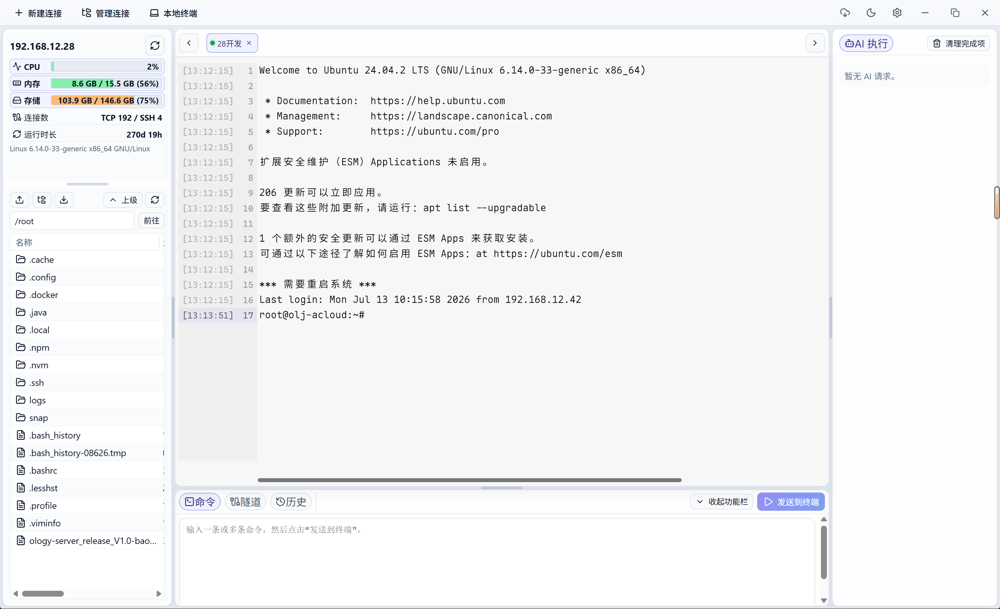

# MyTerminal

[English](./README.md) | [简体中文](./README_CN.md)


一个基于 Rust、Tauri 2 和 React 构建的现代桌面 SSH 终端管理工具。

MyTerminal 把终端标签页、支持跳板机与代理的 SSH 连接管理、SFTP 文件管理、远程文件编辑、本地端口转发和 WebDAV 备份放到一个清爽的桌面应用里。它面向开发者和运维场景，希望提供一个轻量、开放、可折腾的远程终端工具。



## 功能清单

### SSH 连接与链路

- **SSH 连接管理** - 支持新建、编辑、分组、复制、移动、拖拽排序，并可在连接前测试配置。
- **密码与私钥认证** - 支持 SSH 密码、私钥文件、粘贴私钥内容认证，以及密码 / 私钥口令的明文查看开关。
- **跳板机链路** - 支持按顺序配置多级 SSH 跳板机，终端、文件操作、隧道和 MCP Bridge 会话统一复用这套链路模型。
- **首跳代理** - 支持通过 SOCKS5 或 HTTP CONNECT 代理连接第一跳 SSH，并可配置代理认证。
- **连接清理** - 关闭标签、删除连接或退出应用时，会清理相关终端会话、辅助 SSH 会话、隧道和 CLI Bridge 进程。

### 终端工作区

- **多标签 SSH 终端** - 支持真实 SSH PTY 会话、多会话标签页、标签拖拽排序、原位重连、关闭会话，并根据 SSH 连接显示标签标题。
- **非阻塞连接启动** - 打开 SSH 标签后立即进入 connecting 状态，SSH 握手与认证在后台线程完成，避免界面等待网络。
- **交互输入处理** - 普通字符使用极短合并窗口降低 WebView 到 Rust 的 IPC 压力，Enter、Tab、控制序列和编辑键立即发送到远端 PTY。
- **右键工作流** - 支持右键菜单复制 / 粘贴，也可配置右键直接粘贴；菜单操作结束后会把焦点交回终端。
- **光标恢复** - 远端程序隐藏光标后如果异常返回 shell，提示符边界会兜底恢复光标，避免后续输入看不到插入点。
- **本地光标兜底** - 切换会话或重放缓存输出时，前端会恢复 xterm 光标显示，且不会把控制符发送回 SSH。
- **搜索与自适应尺寸** - 基于 xterm.js 提供终端渲染、尺寸适配和搜索能力。
- **会话焦点管理** - 切换会话、重连或 SSH 后台启动完成后，会在目标终端可输入时恢复输入焦点。
- **SSH 长行展示模式** - SSH 会话可选择自动换行，或使用横向滚动把长输出保留在同一行并跟随光标；本地终端与 TUI 始终自动换行。
- **终端路径联动** - 注入远端 cwd 同步钩子后，终端执行 `cd`、`pushd`、`popd` 可联动文件管理器路径。
- **直接输入路径刷新** - 手输或粘贴 `cd` 命令后会提前刷新文件面板，后端 cwd 标记返回后再做最终校正。
- **子 Shell 路径同步** - Bash 子 Shell 会继承 cwd 同步钩子，非交互脚本不会输出 MyTerminal 的同步标记。
- **远端历史读取** - 可读取远端 shell 历史文件用于命令历史能力，同时隐藏 MyTerminal 内部注入命令。

### 本地终端与 AI CLI

- **本地终端标签页** - 可在 SSH 标签旁打开本地原生 PTY 会话，底层使用 ConPTY / portable-pty，而不是模拟输出。
- **AI CLI 启动器** - 可在指定工作目录启动 Claude Code、Codex、opencode 或自定义本地命令。
- **纯 Shell 模式** - 选择内置“本地终端”命令时，会直接打开配置的本机 Shell，不强制启动 AI CLI。
- **本地专属配置** - 本地 Shell 路径、命令预设和历史目录写入 `local-terminals.json`，不会进入 WebDAV 同步包。
- **历史目录** - 可按最近目录重新打开本地终端，并在每次启动前为该目录选择命令，历史记录以目录为主。
- **紧凑本地标签** - 本地终端顶部标签只显示最后一级目录名，例如 `codex · MyTerminal` 或 `MyTerminal`，完整路径仍保留在历史和会话详情中。

### SFTP 文件与编辑

- **远程文件浏览器** - 支持远程目录浏览、文件属性查看、新建目录、删除、重命名、刷新和路径导航，底层使用真实 SFTP 操作。
- **拖放上传** - 支持把本地文件或文件夹拖入 SFTP 文件浏览器上传，并可递归上传文件夹。
- **批量传输** - 支持远端多选文件 / 文件夹下载、本地多路径上传，同名本地下载会自动生成唯一目标路径，避免覆盖。
- **文件连接复用** - 文件浏览、传输、远程编辑、运行状态和历史读取会复用辅助 SSH / SFTP 会话，避免每次操作都重新握手。
- **失效会话恢复** - 辅助 SSH 缓存被远端空闲回收时会丢弃旧连接并自动重试一次。
- **远端身份缓存** - 远端 uid / gid 对应的用户名和组名会在辅助会话内缓存，目录刷新时不重复读取 `/etc/passwd` 和 `/etc/group`。
- **远程文件编辑器** - 内置 Monaco 编辑器，支持读取远端文件、触发编辑器保存动作，并通过 SFTP 写回保存。
- **编辑器恢复缓存** - 远程文件加载或保存异常时，本地文档缓存可作为恢复兜底。
- **MCP / CLI 文件工具** - AI 客户端可通过审批后的 Bridge 操作列目录、读写文件、上传、下载、删除、重命名和创建目录。

### 运行状态与隧道

- **运行状态概览** - 可读取当前 SSH 连接的远端 OS、CPU、内存、磁盘、主机 IP 和 uptime 信息。
- **本地端口转发** - 支持本地端口转发记录的新建、编辑、开启和停止，并可配置 bind 地址与目标地址。
- **隧道生命周期管理** - 运行中的隧道和终端会话分开记录，可独立停止和清理。

### MCP Bridge 与 AI 审批

- **面向 AI 编程工具的 MCP Bridge** - 让 Claude Code、Codex 等 MCP 客户端通过本地 `CLI + MCP + GUI Broker` 使用已保存 SSH 连接。
- **连接发现** - MCP 客户端可读取 SSH 连接的脱敏元信息，包括名称、分组路径、主机、端口、用户名、标签和备注。
- **桥接会话** - MCP 客户端可通过连接 ID 或唯一连接名称打开和关闭逻辑 SSH Bridge 会话，并基于会话执行远程命令或文件操作。
- **GUI 审批执行** - 远程命令、上传、下载、写入、删除、重命名和创建目录请求默认进入 MyTerminal 审批面板。
- **右侧 AI 执行栏** - 待审批和已完成的 AI 请求会显示在可调整宽度的右侧栏，命令、文件和历史面板可继续使用。
- **会话命令串行** - 同一个 AI Bridge 会话内的命令会按顺序执行，不同会话仍可并发执行。
- **自动执行控制** - 可全局开启 Bridge 自动执行，也可在关闭全局自动执行时按 SSH 连接配置白名单。
- **AI 审批通知** - 待确认请求可自动展开 AI 执行面板，展示 SSH 机器、命令或目标摘要，并在系统支持时通过桌面通知按钮快速审批。
- **Agent 使用引导** - MCP 客户端会收到工具说明，明确 list/open/use/close 流程、sessionId 规则和文件写入建议。
- **Bridge 稳定性** - MCP Bridge 设置重启时保留 AI 逻辑会话，等待请求处理更可预期，应用退出时会清理 Bridge 资源。

### 同步、备份与更新

- **WebDAV 手动同步** - 应用设置与 SSH 连接可分开上传、下载，方便多设备迁移。
- **本地导入 / 导出** - 支持导出 JSON 配置包，也支持导入覆盖；导入前会自动备份当前本地数据。
- **桌面更新流程** - 可检测 GitHub Release、识别安装包、下载安装包，并从应用内启动安装。
- **代理感知更新检查** - 更新请求会遵循系统代理设置，并使用保守的连接、读取和总时长超时。
- **安装包缓存校验** - 安装包下载会先写入临时文件，按 Release 资产大小校验完整性，只有完整缓存才会被复用。

### 桌面体验

- **双语界面** - 支持简体中文 / English 切换。
- **主题与布局偏好** - 支持深浅色、紧凑侧边栏、终端字体、终端背景图片、右键行为和长行展示模式等设置。
- **系统托盘** - 支持桌面托盘图标，方便从系统外壳快速访问。
- **本地优先存储** - 设置和 SSH 连接保存在本地，应用内部处理敏感字段；只有显式导出 JSON 时才会生成明文配置包。

## 下载

当项目发布版本标签时，Windows 安装包会发布在 [GitHub Releases](https://github.com/CrazyFigure/MyTerminal/releases) 页面。

MyTerminal 目前仍处于早期阶段。请妥善备份重要 SSH 连接配置，也不要把本地导出的 JSON 当作加密备份使用：导出文件中会包含敏感值明文。

## 快速开始

### 环境要求

- Node.js 20.19+ 或 22.12+
- npm 9+
- Rust stable，使用 MSVC toolchain
- Visual Studio Build Tools 2022
- Windows 10/11 SDK
- Windows 下 vendored OpenSSL 需要时，建议安装 Strawberry Perl

### 从源码运行

```powershell
npm install
npm run check:env
npm run tauri:dev
```

### 构建安装包

```powershell
npm run package
```

构建产物通常位于：

```text
src-tauri/target/release/bundle/
```

完整 Windows 环境准备、启动和打包说明请查看 [START_BUILD.md](./START_BUILD.md)。

## MCP Bridge

MyTerminal 可以把已保存的 SSH 连接通过本地 `CLI + MCP + GUI Broker` 桥接给 Claude Code、Codex 和其他 MCP 客户端使用。

### 工作方式

- MCP Bridge 初始默认关闭，需要在 **设置 > MCP** 中手动开启；开启状态与自动执行策略会持久化，并在 MyTerminal 重启后按原配置恢复。
- 开启后，MyTerminal 会在 `127.0.0.1` 启动本地 Broker，并写入包含端口与 token 的 discovery 文件。
- 安装版优先由 MCP 客户端直接启动随 MyTerminal 分发的 `myterminal-cli`；开发态找不到 CLI 时才通过项目内 `npx` launcher 启动。
- Agent 应先列出连接；简单任务可把返回的连接 ID（或唯一连接名称）直接作为远程工具的 `sessionId`，Bridge 会自动建立逻辑会话。如需独立会话，也可显式打开并复用返回的 `sessionId`，任务结束后关闭。
- 连接列表、目录列表、文件读取等只读工具可直接执行。
- 同一 Bridge 会话内的命令会串行执行，避免远端状态顺序错乱；不同会话可以并发。
- 远程命令、本地上传、远端下载和写操作默认会进入 MyTerminal 的 AI 请求面板，由用户手动批准。
- 新的待审批请求可自动展开 AI 执行面板并发送桌面通知；点击通知会聚焦审批列表。
- 如需自动执行，可在 MCP 设置页全局开启，或在关闭全局自动执行时按 SSH 连接配置白名单。

### MCP 客户端配置

可以直接复制 **设置 > MCP > 使用方式** 中的 JSON。开发态示例如下：

```json
{
  "mcpServers": {
    "myterminal": {
      "type": "stdio",
      "command": "npx",
      "args": [
        "--yes",
        "C:/Software/WorkSpace/MyTerminal/mcp/myterminal-mcp"
      ]
    }
  }
}
```

### 可用 MCP 工具

- `myterminal_list_connections`
- `myterminal_open_session`
- `myterminal_close_session`
- `myterminal_run_command`
- `myterminal_file_list`
- `myterminal_file_read`
- `myterminal_file_write`
- `myterminal_file_upload`
- `myterminal_file_download`
- `myterminal_file_delete`
- `myterminal_file_rename`
- `myterminal_file_mkdir`

连接列表只返回名称、分组路径、主机、端口、用户名、标签和备注等脱敏元信息，不会通过 MCP 暴露密码、私钥或私钥口令。

## 常用脚本

```powershell
npm run dev          # 仅启动 Vite 前端开发服务器
npm run typecheck    # 执行前端 TypeScript 类型检查
npm run check:web    # 构建前端
npm run check:rust   # 检查 Rust/Tauri 后端
npm run check:perl   # 检查本机 Perl 环境
npm run check:env    # 检查 Node、npm、cargo、Perl、link.exe
npm run check        # 执行前端构建和 Rust 后端检查
```

## 技术栈

- **桌面外壳：** Tauri 2
- **后端：** Rust、ssh2、reqwest、AES-GCM、本地 JSON 持久化
- **前端：** React、TypeScript、Vite、Zustand
- **终端与编辑器：** xterm.js、portable-pty、Monaco Editor
- **同步与文件：** SFTP、WebDAV、本地导入 / 导出

## 致谢

- 感谢 [Linux.do](https://linux.do) 社区对项目的推广与反馈。

## Star 走势

[](https://github.com/CrazyFigure/MyTerminal/stargazers)

## License

[MIT](./LICENSE) © 2026 CrazyFigure
