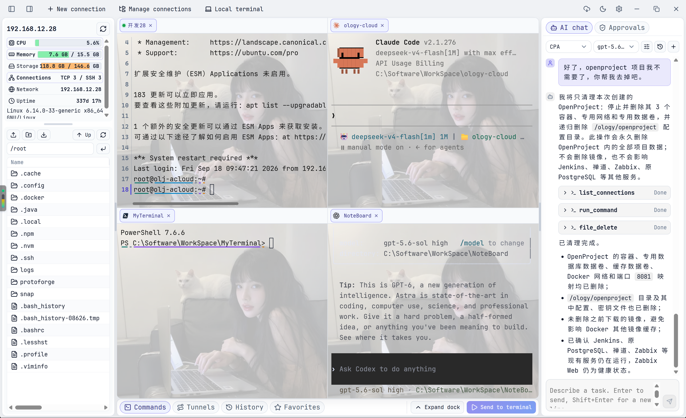

# MyTerminal

[English](./README_EN.md) | [简体中文](./README.md)

A modern desktop SSH terminal manager built with Rust, Tauri 2, and React.

MyTerminal brings terminal tabs with drag-to-split layouts, SSH profiles with jump hosts and proxies, Windows Remote Desktop, SFTP file management, remote file editing, local port forwarding, a built-in AI assistant, and WebDAV backup together in one desktop app. It aims to provide an elegant, lightweight, comprehensive, and ergonomic remote terminal tool.

## Features

### SSH Profiles and Routing

- **SSH profile manager** - Create, edit, group, duplicate, sort, test
- **Password and private-key auth** - Key file, pasted key, secret visibility
- **Jump hosts** - Multi-hop chains shared by terminals, files, and tunnels
- **First-hop proxies** - SOCKS5 / HTTP CONNECT
- **Windows Remote Desktop (RDP)** - Opens in the system client, Windows only

### Terminal Workspace

- **Tabbed terminals** - SSH and local terminals mixed, reorder, reconnect in place
- **Local terminals** - Native PTY, with shell detection and default shell selection
- **AI CLI launcher** - Claude Code, Codex, opencode, or custom commands
- **Drag-to-split layouts** - Eight snap points, up to four panes with per-pane tab bars
- **Bottom dock** - History, favorite commands, bulk sending, tunnels
- **Display helpers** - Line numbers and timestamps, selection match highlighting, prompt coloring
- **Line wrap modes** - Wrap automatically or scroll horizontally
- **Path-aware output** - `cd`, `pushd`, and `popd` drive the file panel

### SFTP Files and Editing

- **Remote file management** - Browse, drag-and-drop upload, batch transfers, metadata and rename
- **Built-in editor** - Monaco for remote files, written back over SFTP
- **MCP/CLI file tools** - Approved remote file reads and writes

### Runtime and Tunnels

- **Runtime overview** - CPU, memory, root filesystem, connections, uptime, OS
- **Resource details** - Per-core usage, process/thread top list, connection addresses
- **Multiple resource sources** - System processes / Docker / Podman / Kubernetes
- **Local port forwarding** - Create, edit, start, stop

### AI Assistant and MCP

- **AI chat panel** - Streaming output, stop control, new chats, local history
- **Endpoints, models, and protocols** - Anthropic Messages / OpenAI Chat Completions / OpenAI Responses, keys encrypted
- **Thinking effort and compaction** - Older messages folded past a threshold
- **AI operations on remote hosts** - List connections, run commands, read and write files
- **Commands run in real terminals** - Typed into a visible tab with an `[AI]` prefix
- **MCP Bridge** - Let Claude Code, Codex, and others use saved SSH profiles
- **Non-secret discovery and sessions** - Open and close by connection ID or unique name
- **GUI-approved execution** - Approve each request, or auto-execute globally or per connection

For client configuration and the tool list, see [ARCHITECTURE.md](./ARCHITECTURE.md).

### Sync, Backup, and Updates

- **Manual WebDAV sync** - Upload and download settings and profiles separately
- **Local import/export** - JSON packages, with an automatic backup before import; exports are plain text, not encrypted backups
- **In-app updates** - Check, download, and launch the installer

### Desktop Experience

- **Bilingual UI** - Simplified Chinese / English
- **Appearance settings** - Fonts, sizes, line heights, background image, light and dark themes
- **Local-first storage** - Settings and secrets encrypted locally

## Download

Windows installers are published on the [GitHub Releases](https://github.com/CrazyFigure/MyTerminal/releases) page when a version tag is released.

## Quick Start

Environment requirements, running from source, check commands, and installer packaging are all documented in [START_BUILD.md](./START_BUILD.md).

## Acknowledgements

- Thanks to the [Linux.do](https://linux.do) community for project promotion and feedback.

## Star History

## License

[MIT License with Commons Clause License Condition v1.0](./LICENSE) © 2026
CrazyFigure. Free internal production use by businesses is permitted. You may
not sell MyTerminal itself or offer a paid product or service whose value
derives entirely or substantially from MyTerminal without prior written
authorization from the copyright holder. This is a source-available license,
not an OSI-approved open-source license.
